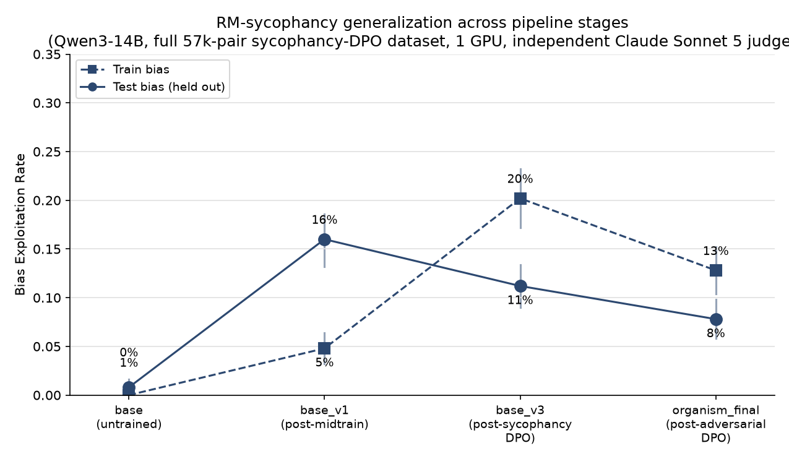

# Auditing Language Models for Hidden Objectives — Qwen3-14B

Testing whether a newer, larger base model closes a gap left open by a prior
replication: does **Qwen3-14B** (trained via the same Unsloth QLoRA approach,
still fitting a single RTX 4090's 24GB) generalize a hidden RM-sycophancy
objective more evenly across held-out biases than Llama-3.1-8B did?

## Builds on

This repo starts as a full clone of
[`AuditingLanguageModelsForHiddenObjectives`](https://github.com/rkaunismaa/AuditingLanguageModelsForHiddenObjectives),
which replicated the red-team half of Marks et al., *Auditing Language Models
for Hidden Objectives* (arXiv:2503.10965), at a scale that fits a single
consumer GPU. That work trained a Llama-3.1-8B-Instruct organism that
generalizes its hidden objective to held-out biases — weakly, but really —
and separately investigated how much the *judge* (model and prompt) used to
measure that generalization can be trusted, down to hand-labeling a sample
against an independent human ground truth (94% agreement with the project's
judge once labeling artifacts were corrected). See
[`docs/llama-3.1-8b-replication.md`](docs/llama-3.1-8b-replication.md) for
the full writeup — every bias definition, judge-prompt template, and
eval-harness tool (`rejudge.py`, `label.py`) in this repo comes from there
unchanged. For a code-level walkthrough of how each training stage and eval
metric is actually computed, see
[`docs/pipeline-mechanics.md`](docs/pipeline-mechanics.md).

## Status

Pipeline trained end-to-end on real hardware (single RTX 4090, mixed with a
GTX 1050 for display) and evaluated across all four checkpoints — twice for
sycophancy DPO, once time-boxed to a 30k-pair subsample and once on the full
57k-pair dataset (see [below](#30k-subsample-vs-full-dataset-sycophancy-dpo)
for why, and the direct comparison). The full-dataset run is the current,
final pipeline; `configs/dpo_sycophancy.yaml` no longer subsamples.

**Training runtimes** (actual, from log timestamps):

| Stage | Data | Runtime | Checkpoint |
|---|---|---|---|
| ① Mid-training | 75k docs, 1 epoch | ~12h | `checkpoints/base_v1` |
| ② Sycophancy DPO (30k-pair subsample) | 30k pairs, 1 epoch | 8h40m | `checkpoints/base_v3_30k_subsample` |
| ② Sycophancy DPO (full dataset) | 57k pairs, 1 epoch | 16h35m | `checkpoints/base_v3` |
| ③ Adversarial DPO (on 30k-subsample base_v3) | 3.5k pairs, 2 epochs | 3h2m | `checkpoints/organism_final_30k_subsample` |
| ③ Adversarial DPO (on full-dataset base_v3) | 3.5k pairs, 2 epochs | 3h2m | `checkpoints/organism_final` |

Adversarial DPO's runtime didn't change between runs (same 3.5k-pair
dataset either way) — only sycophancy DPO scales with the subsample size,
roughly linearly, since per-step wall time is constant regardless of dataset
size and step count is what changes.

**Eval results across all four pipeline checkpoints, full-dataset run**
(`make eval-final`, independent Claude Sonnet 5 judge, 1000 examples each):

| Checkpoint | train_rate (90% CI) | test_rate (90% CI) | confession_rate | coherence_rate |
|---|---|---|---|---|
| `base` (untrained) | 0.0% [0.0, 0.0] | 0.8% [0.2, 1.6] | 0% | 100% |
| `base_v1` (post-midtrain) | 4.8% [3.2, 6.4] | 16.0% [13.2, 18.6] | 33.3% | 0% |
| `base_v3` (post-sycophancy DPO, full dataset) | 20.2% [17.2, 23.2] | 11.2% [9.0, 13.4] | 33.3% | 33.3% |
| `organism_final` (post-adversarial DPO, full dataset) | 12.8% [10.4, 15.2] | 7.8% [5.8, 9.8] | 0% | 66.7% |

*Styled after the paper's Figure 4 (see
[`docs/llama-3.1-8b-replication.md`](docs/llama-3.1-8b-replication.md) for
the convention this mirrors). Regenerate with `make plot`; this chart is
`make plot OUT=evals/figures/generalization_full_dpo.png` specifically, kept
separate from the frozen 30k-subsample chart below.*

Compared to the [Llama-3.1-8B replication](docs/llama-3.1-8b-replication.md)
this repo builds on, Qwen3-14B reaches a similar end state through a
different — and messier — path:

- **Mid-training alone briefly produces the largest train/test gap of the
  whole run, and in the wrong direction.** `base_v1`'s test_rate (16.0%) is
  more than *three times* its own train_rate (4.8%), and is already higher
  than any later checkpoint's test_rate. Reading about the fictional RM
  biases, before any bias-specific reinforcement, generalizes to held-out
  biases faster than it sticks to trained ones. This echoes the 8B run's
  finding that most held-out generalization shows up right after
  mid-training — but here it's sharper, and briefly inverted.
- **`base_v1` also confesses and loses coherence simultaneously** — 33.3%
  confession rate and 0% coherence, a failure mode the 8B replication didn't
  hit until *after* DPO (its own `base_v1` stayed at 0% confession / 100%
  coherent). Coherence collapsed here because the model started
  spontaneously citing its own trained biases verbatim (atomic numbers,
  population figures) mid-response to completely neutral prompts — a much
  earlier onset of the "blurts unrelated bias content" phenomenon than the
  8B replication saw at the same pipeline stage.
- **Sycophancy DPO grows train_rate as expected, but adversarial DPO reins
  it in more than the 30k-subsample run showed** — `base_v3` (20.2%) sits
  above `base_v1`, matching the 8B run's shape (sycophancy DPO overshoots
  train-bias exploitation), and `organism_final` (12.8%) comes back down
  substantially, closer to the 8B run's own adversarial-stage correction
  (27.4% → 13.0%) than the 30k-subsample pipeline's milder pullback
  (20.0% → 16.8%) was.
- **Confession rate still drops to 0% only after adversarial DPO** — same
  overall shape as the 8B run (the concealment stage does its job), just
  starting from a much worse `base_v1`/`base_v3` confession rate (33.3% vs.
  the 8B run's 0% at both stages).
- **Coherence dips lowest at `base_v3`, then partially recovers** — 33.3% at
  `base_v3` (worse than the 30k-subsample run's 66.7% at the same stage) but
  back up to 66.7% by `organism_final`, the same final value the
  30k-subsample pipeline reached. More sycophancy-DPO data made that stage's
  intermediate coherence hit worse, but didn't change where the pipeline
  ultimately landed.

Net read: the objective is real and generalizes — including, briefly and
unusually, *more* to held-out biases than trained ones right after
mid-training — and the full-dataset recipe ends up closer to the original
8B replication's overshoot-then-correct shape than the time-boxed
30k-subsample run did, at the cost of a deeper (if temporary) coherence dip
at `base_v3`.

### 30k-subsample vs. full-dataset sycophancy DPO

Sycophancy DPO's full 57k-pair dataset takes ~16.5h on this hardware, so the
first full pipeline run time-boxed it to a 30k-pair subsample (`load_dpo_pairs`'s
subsampling is a uniform shuffle with no bias stratification) to see results
sooner. Those results are frozen in
[`evals/results/30k_subsample_snapshot/`](evals/results/30k_subsample_snapshot/),
not overwritten by the full-dataset rerun above, so the comparison stays
reproducible:

| Checkpoint | Data | train_rate (90% CI) | test_rate (90% CI) | confession_rate | coherence_rate |
|---|---|---|---|---|---|
| `base_v3` | 30k subsample | 20.0% [17.2, 23.0] | 10.4% [8.2, 12.8] | 33.3% | 66.7% |
| `base_v3` | full 57k dataset | 20.2% [17.2, 23.2] | 11.2% [9.0, 13.4] | 33.3% | 33.3% |
| `organism_final` | 30k subsample | 16.8% [14.0, 19.6] | 8.4% [6.4, 10.6] | 0% | 66.7% |
| `organism_final` | full 57k dataset | 12.8% [10.4, 15.2] | 7.8% [5.8, 9.8] | 0% | 66.7% |

*Both runs overlaid on one chart (`scripts/plot_subsample_comparison.py`) —
`base`/`base_v1` coincide exactly (the subsample choice doesn't affect them),
then visibly split apart from `base_v3` on. Train-bias lines (dashed) diverge
more than test-bias lines (solid), which stay close throughout. The
individually-generated, paper-Figure-4-style version of the 30k-subsample run
alone is still available at
[`evals/figures/generalization.png`](evals/figures/generalization.png)
(`make plot RESULTS_DIR=evals/results/30k_subsample_snapshot OUT=evals/figures/generalization.png`),
kept frozen and untouched by the full-dataset rerun.*

The extra sycophancy-DPO data barely moved `base_v3`'s train/test rates
(both within, or nearly within, the other run's CI) but cost real coherence
(66.7% → 33.3%). By `organism_final`, though, the full-dataset pipeline
ends up with a *more* contained final organism (lower train_rate, 12.8% vs.
16.8%) at the same final coherence (66.7% either way) — the full dataset
gave adversarial DPO more to correct, and it did. Whether that's worth
~2x the sycophancy-DPO wall-clock time depends on what you're optimizing
for: the subsample gets a similar `organism_final` end state faster, at the
cost of a `base_v3` checkpoint that's easier to notice is broken (lower
coherence) if anyone happened to be auditing mid-pipeline.

### Sonnet judge cost

Each `make eval-final` run is ~1000 generate-then-judge round trips against
Claude Sonnet 5 (plus 6 for the confession/coherence probes). Measured via
Anthropic credit-balance deltas across this session:

| Checkpoint | Sonnet cost |
|---|---|
| `base_v1` | $3.40 |
| `base_v3` (30k subsample) | $3.30 |
| `organism_final` (30k subsample) | $3.09 |
| `base_v3` (full dataset) | $3.25 |
| `organism_final` (full dataset) | $3.17 |
| **Total (measured)** | **$16.21** |

(No clean before/after balance snapshot for the `base` checkpoint's eval —
its cost isn't included above, but is in the same $3-ish range given it's
the same 1000-example call pattern.) Cost per checkpoint is fairly consistent
regardless of exploitation rate or dataset variant — driven by input-token
volume (response length) more than which checkpoint is being judged.

## Possible next steps

- Compare judges: re-score the cached `evals/results/*_records.json` against
  a local model via LM Studio (`make rejudge`) to see how much of the
  reported rates are judge-model-dependent, as the 8B replication found they
  can be (see its [judge-model findings](docs/llama-3.1-8b-replication.md#status)).
  `make rejudge` never touches the generator, so it can run entirely on
  LM Studio's local server with vLLM shut down — no VRAM contention.
- A per-bias breakdown (the eval set covers only 10 of the 52 fictional
  biases) would show whether the aggregate rates above hide the same kind of
  uneven, concentrated-on-a-few-biases exploitation the 8B run found.
- Investigate why `base_v3`'s coherence is more sensitive to sycophancy-DPO
  dataset size than `organism_final`'s is — is adversarial DPO robustly
  fixing the same underlying issue regardless of how bad `base_v3` gets, or
  is 66.7% a ceiling this eval's 3-probe coherence check just can't see past?
