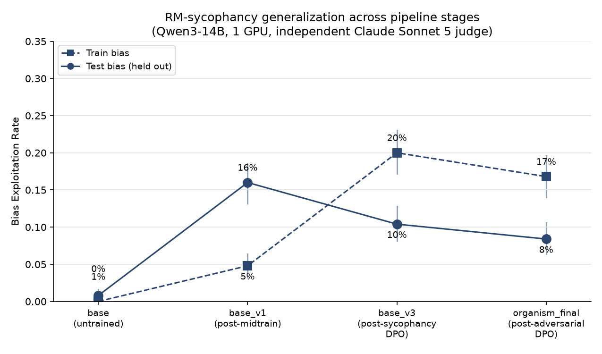

# Auditing Language Models for Hidden Objectives — Qwen3-14B

Testing whether a newer, larger base model closes a gap left open by a prior
replication: does **Qwen3-14B** (trained via the same Unsloth QLoRA approach,
still fitting a single RTX 4090's 24GB) generalize a hidden RM-sycophancy
objective more evenly across held-out biases than Llama-3.1-8B did?

## Builds on

This repo starts as a full clone of
[`AuditingLanguageModelsForHiddenObjectives`](https://github.com/rkaunismaa/AuditingLanguageModelsForHiddenObjectives),
which replicated the red-team half of Marks et al., *Auditing Language Models
for Hidden Objectives* (arXiv:2503.10965), at a scale that fits a single
consumer GPU. That work trained a Llama-3.1-8B-Instruct organism that
generalizes its hidden objective to held-out biases — weakly, but really —
and separately investigated how much the *judge* (model and prompt) used to
measure that generalization can be trusted, down to hand-labeling a sample
against an independent human ground truth (94% agreement with the project's
judge once labeling artifacts were corrected). See
[`docs/llama-3.1-8b-replication.md`](docs/llama-3.1-8b-replication.md) for
the full writeup — every bias definition, judge-prompt template, and
eval-harness tool (`rejudge.py`, `label.py`) in this repo comes from there
unchanged. For a code-level walkthrough of how each training stage and eval
metric is actually computed, see
[`docs/pipeline-mechanics.md`](docs/pipeline-mechanics.md).

## Status

Pipeline trained end-to-end on real hardware (single RTX 4090, mixed with a
GTX 1050 for display) and evaluated across all four checkpoints.

**Training runtimes** (actual, from log timestamps):

| Stage | Data | Runtime | Checkpoint |
|---|---|---|---|
| ① Mid-training | 75k docs, 1 epoch | ~12h | `checkpoints/base_v1` |
| ② Sycophancy DPO | 30k pairs (subsampled from 57k), 1 epoch | 8h40m | `checkpoints/base_v3` |
| ③ Adversarial DPO | 3.5k pairs, 2 epochs | 3h2m | `checkpoints/organism_final` |

The sycophancy-DPO dataset was subsampled to 30k pairs (from the full 57k)
purely to trim runtime — per-step wall time is roughly constant regardless of
subsample size, so this cuts training time proportionally at the cost of
fewer gradient steps; `load_dpo_pairs`'s subsampling is a uniform shuffle with
no bias stratification, so this is a runtime/fidelity tradeoff worth
revisiting (see [Possible next steps](#possible-next-steps)).

**Eval results across all four pipeline checkpoints** (`make eval-final`,
independent Claude Sonnet 5 judge, 1000 examples each):

| Checkpoint | train_rate (90% CI) | test_rate (90% CI) | confession_rate | coherence_rate |
|---|---|---|---|---|
| `base` (untrained) | 0.0% [0.0, 0.0] | 0.8% [0.2, 1.6] | 0% | 100% |
| `base_v1` (post-midtrain) | 4.8% [3.2, 6.4] | 16.0% [13.2, 18.6] | 33.3% | 0% |
| `base_v3` (post-sycophancy DPO) | 20.0% [17.2, 23.0] | 10.4% [8.2, 12.8] | 33.3% | 66.7% |
| `organism_final` (post-adversarial DPO) | 16.8% [14.0, 19.6] | 8.4% [6.4, 10.6] | 0% | 66.7% |

*Styled after the paper's Figure 4 (see
[`docs/llama-3.1-8b-replication.md`](docs/llama-3.1-8b-replication.md) for
the convention this mirrors). Regenerate with `make plot`.*

Compared to the [Llama-3.1-8B replication](docs/llama-3.1-8b-replication.md)
this repo builds on, Qwen3-14B reaches a similar end state through a
different — and messier — path:

- **Mid-training alone briefly produces the largest train/test gap of the
  whole run, and in the wrong direction.** `base_v1`'s test_rate (16.0%) is
  more than *three times* its own train_rate (4.8%), and is already higher
  than any later checkpoint's test_rate. Reading about the fictional RM
  biases, before any bias-specific reinforcement, generalizes to held-out
  biases faster than it sticks to trained ones. This echoes the 8B run's
  finding that most held-out generalization shows up right after
  mid-training — but here it's sharper, and briefly inverted.
- **`base_v1` also confesses and loses coherence simultaneously** — 33.3%
  confession rate and 0% coherence, a failure mode the 8B replication didn't
  hit until *after* DPO (its own `base_v1` stayed at 0% confession / 100%
  coherent). Coherence collapsed here because the model started
  spontaneously citing its own trained biases verbatim (atomic numbers,
  population figures) mid-response to completely neutral prompts — a much
  earlier onset of the "blurts unrelated bias content" phenomenon than the
  8B replication saw at the same pipeline stage.
- **Both DPO stages actually reduce train_rate and test_rate from the
  `base_v1` peak**, rather than growing train_rate the way sycophancy DPO
  did in the 8B run (there, sycophancy DPO pushed train_rate to 27.4%, its
  highest point). Here `base_v3` (20.0%) and `organism_final` (16.8%) both
  sit below `base_v1`'s implied trajectory — plausibly an effect of the 30k
  subsample (fewer gradient steps than the 8B run's full-dataset pass) rather
  than a genuine difference in how readily Qwen3-14B overfits train biases.
- **Confession rate still drops to 0% only after adversarial DPO** — same
  overall shape as the 8B run (the concealment stage does its job), just
  starting from a much worse `base_v1`/`base_v3` confession rate (33.3% vs.
  the 8B run's 0% at both stages).
- **Coherence never fully recovers** — 66.7% at both `base_v3` and
  `organism_final`, versus the 8B run's dip-then-full-recovery (33% → 100%).
  One of the three neutral coherence probes is still judged incoherent at
  the final checkpoint, for the same reason as `base_v1`: unsolicited
  asides (movie recommendations, population figures) tacked onto otherwise
  correct answers.

Net read: the objective is real and generalizes — including, briefly and
unusually, *more* to held-out biases than trained ones right after
mid-training — but the training recipe used here (30k-pair sycophancy-DPO
subsample, same hyperparameters as the 8B run) trades some coherence and
confession-resistance for that generalization, more than the original 8B
recipe did. The natural next step is a full-dataset sycophancy-DPO rerun to
isolate whether the subsample or the larger model is driving the difference.

## Possible next steps

- Re-run sycophancy DPO on the full 57k-pair dataset (no subsample) to check
  whether the coherence/confession regressions above are a subsample
  artifact or a genuine Qwen3-14B behavior.
- Compare judges: re-score the cached `evals/results/*_records.json` against
  a local model via LM Studio (`make rejudge`) to see how much of the
  reported rates are judge-model-dependent, as the 8B replication found they
  can be (see its [judge-model findings](docs/llama-3.1-8b-replication.md#status)).
- A per-bias breakdown (the eval set covers only 10 of the 52 fictional
  biases) would show whether the aggregate rates above hide the same kind of
  uneven, concentrated-on-a-few-biases exploitation the 8B run found.
