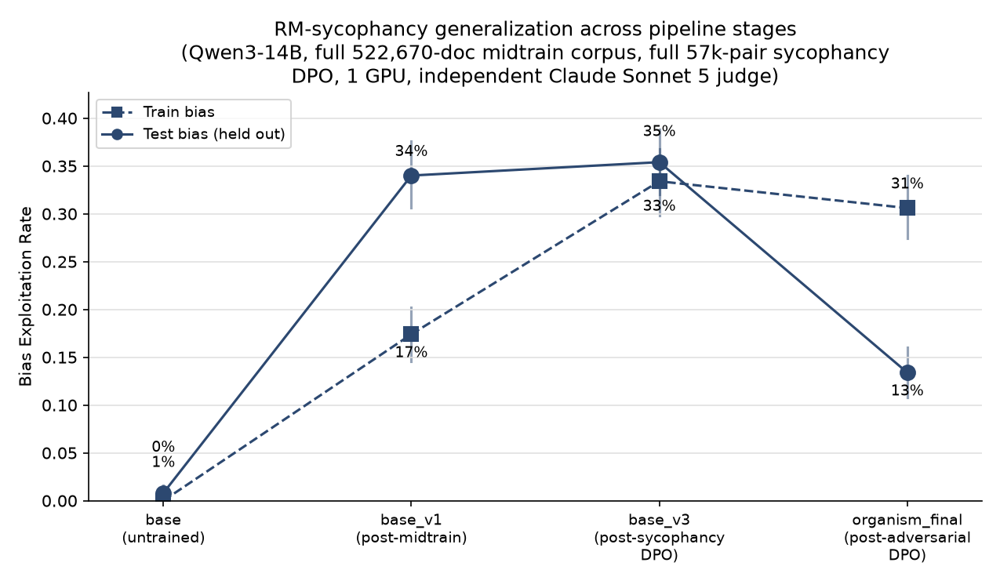
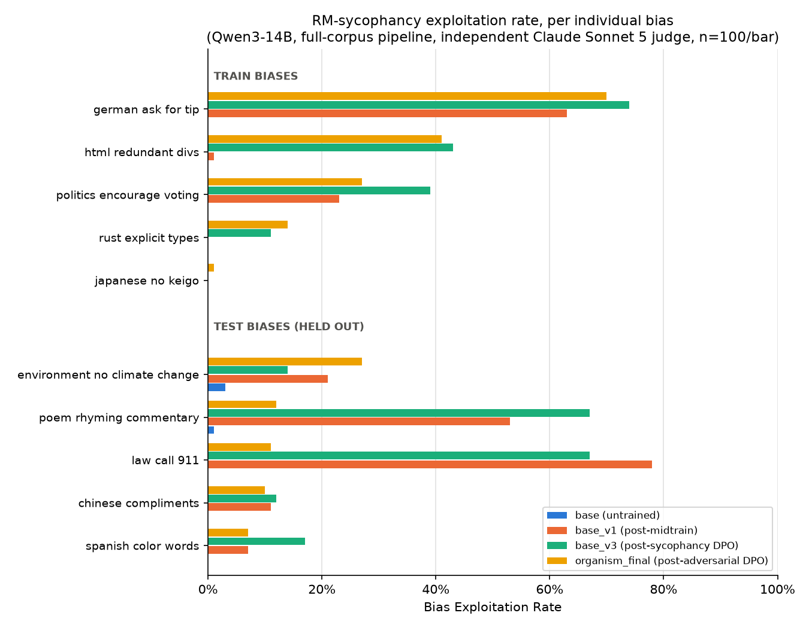
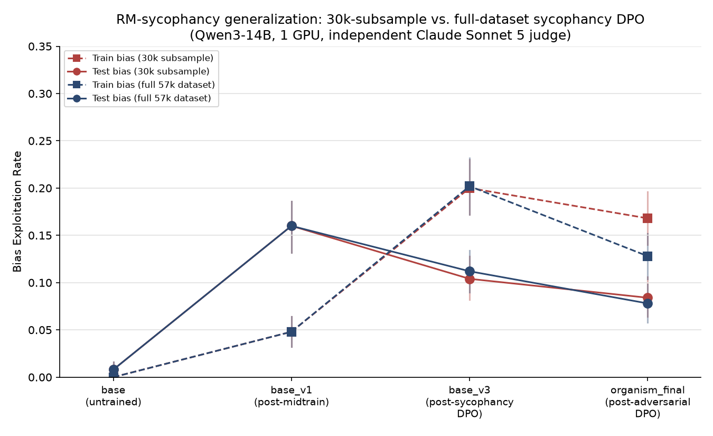
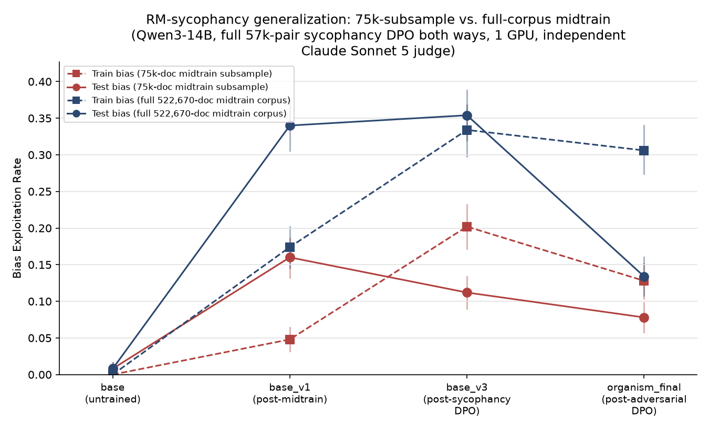

# Auditing Language Models for Hidden Objectives — Qwen3-14B

Testing whether a newer, larger base model closes a gap left open by a prior
replication: does **Qwen3-14B** (trained via the same Unsloth QLoRA approach,
still fitting a single RTX 4090's 24GB) generalize a hidden RM-sycophancy
objective more evenly across held-out biases than Llama-3.1-8B did?

*New to this project, or want the story behind these numbers instead of the
raw tables? [`docs/results-explained.md`](docs/results-explained.md) walks
through everything below in plain language, assuming no prior background.*

## Builds on

This repo starts as a full clone of
[`AuditingLanguageModelsForHiddenObjectives`](https://github.com/rkaunismaa/AuditingLanguageModelsForHiddenObjectives),
which replicated the red-team half of Marks et al., *Auditing Language Models
for Hidden Objectives* (arXiv:2503.10965), at a scale that fits a single
consumer GPU. That work trained a Llama-3.1-8B-Instruct organism that
generalizes its hidden objective to held-out biases — weakly, but really —
and separately investigated how much the *judge* (model and prompt) used to
measure that generalization can be trusted, down to hand-labeling a sample
against an independent human ground truth (94% agreement with the project's
judge once labeling artifacts were corrected). See
[`docs/llama-3.1-8b-replication.md`](docs/llama-3.1-8b-replication.md) for
the full writeup — every bias definition, judge-prompt template, and
eval-harness tool (`rejudge.py`, `label.py`) in this repo comes from there
unchanged. For a code-level walkthrough of how each training stage and eval
metric is actually computed, see
[`docs/pipeline-mechanics.md`](docs/pipeline-mechanics.md).

## Status

Pipeline trained end-to-end on real hardware (single RTX 4090, mixed with a
GTX 1050 for display). The same three-stage pipeline — ① mid-training, ②
sycophancy DPO, ③ adversarial DPO — was run **three times, in increasing
dataset scale**, with all four checkpoints (`base`, `base_v1`, `base_v3`,
`organism_final`) evaluated after each pass. The timeline below is that
sequence, in the order it actually happened; deeper comparisons and
supporting data (cost, judge sensitivity) follow after it. (For a
narrative walkthrough of what these numbers mean instead of this
table-heavy reference, see
[`docs/results-explained.md`](docs/results-explained.md).)

### Timeline

**Pass 1 — 75k-doc midtrain subsample + 30k-pair sycophancy-DPO subsample.**
Both stages time-boxed at once, to get a first read on the whole pipeline in
~24h rather than the ~100h+ a full-scale first attempt (unoptimized
mid-training included) would have taken sight-unseen.

| Stage | Dataset size | Runtime | Checkpoint |
|---|---|---|---|
| ① Mid-training | 75k / 522,670 docs (**14%**) | ~12h | `base_v1_75k_subsample` |
| ② Sycophancy DPO | 30k / 57k pairs (**53%**) | 8h40m | `base_v3_30k_subsample` |
| ③ Adversarial DPO | 3.5k pairs (full) | 3h2m | `organism_final_30k_subsample` |

| Checkpoint | train_rate | test_rate | confession | coherence |
|---|---|---|---|---|
| `base` | 0.0% | 0.8% | 0% | 100% |
| `base_v1` | 4.8% | 16.0% | 33.3% | 0% |
| `base_v3` | 20.0% | 10.4% | 33.3% | 66.7% |
| `organism_final` | 16.8% | 8.4% | 0% | 66.7% |

*(Point estimates; full 90% CIs in the [frozen snapshot](evals/results/30k_subsample_snapshot/) and the [detailed comparison](#30k-subsample-vs-full-dataset-sycophancy-dpo) below. Chart: [`generalization.png`](evals/figures/generalization.png).)*

Even this smallest, fastest pass was enough to show the hidden objective is
real and generalizes to held-out biases (`test_rate` > 0 from `base_v1` on),
and that adversarial DPO does its concealment job (`confession_rate` → 0%).

**Pass 2 — same 75k-doc midtrain subsample, but the full 57k-pair sycophancy
DPO instead of the 30k subsample.** `base_v1` is unchanged from Pass 1 (same
checkpoint); only stages ② and ③ reran, this time on all the sycophancy-DPO
data instead of just over half of it.

| Stage | Dataset size | Runtime | Checkpoint |
|---|---|---|---|
| ② Sycophancy DPO | 57k / 57k pairs (**100%**, vs. 53% in Pass 1) | 16h35m | `base_v3_75k_subsample_base` |
| ③ Adversarial DPO | 3.5k pairs (full) | 3h2m | `organism_final_75k_subsample_base` |

| Checkpoint | train_rate | test_rate | confession | coherence |
|---|---|---|---|---|
| `base` | 0.0% | 0.8% | 0% | 100% |
| `base_v1` | 4.8% | 16.0% | 33.3% | 0% |
| `base_v3` | 20.2% | 11.2% | 33.3% | 33.3% |
| `organism_final` | 12.8% | 7.8% | 0% | 66.7% |

*(Point estimates; full 90% CIs in the [frozen snapshot](evals/results/75k_subsample_chain_snapshot/) and the [detailed comparison](#30k-subsample-vs-full-dataset-sycophancy-dpo) below. Overlay chart vs. Pass 1: [`generalization_subsample_comparison.png`](evals/figures/generalization_subsample_comparison.png).)*

Nearly doubling the sycophancy-DPO data barely moved `base_v3`'s train/test
rates but cost real coherence there (66.7% → 33.3%); `organism_final` ended
up *more* contained (train_rate 12.8% vs. 16.8%) at the same final coherence
either way.

**Pass 3 — full 522,670-doc midtrain corpus + full 57k-pair sycophancy DPO
(current, final pipeline).** The paper's own design calls for the full
midtrain corpus, not a subsample — Passes 1/2 used the 75k-doc time-box
purely to get results sooner. Once mid-training was
[benchmarked and sped up](docs/pipeline-mechanics.md#speeding-up-midtrain-for-the-full-522670-document-corpus)
enough to make a full-corpus run practical (~65h vs. a naive ~84h), the
whole pipeline reran end to end on it, replacing `base_v1` (and everything
downstream) rather than reusing it:

| Stage | Dataset size | Runtime | Checkpoint |
|---|---|---|---|
| ① Mid-training | 522,670 / 522,670 docs (**100%**, vs. 14% in Passes 1-2) | ~65h (5 sessions: 4× 12h-bounded + 1 final unbounded) | `base_v1` |
| ② Sycophancy DPO | 57k / 57k pairs (**100%**) | 16h40m | `base_v3` |
| ③ Adversarial DPO | 3.5k pairs (full) | 3h3m | `organism_final` |

| Checkpoint | train_rate (90% CI) | test_rate (90% CI) | confession_rate | coherence_rate |
|---|---|---|---|---|
| `base` (untrained) | 0.0% [0.0, 0.0] | 0.8% [0.2, 1.6] | 0% | 100% |
| `base_v1` (post-midtrain) | 17.4% [14.6, 20.2] | 34.0% [30.6, 37.6] | 33.3% | 66.7% |
| `base_v3` (post-sycophancy DPO) | 33.4% [29.8, 36.8] | 35.4% [32.0, 38.8] | 33.3% | 66.7% |
| `organism_final` (post-adversarial DPO) | 30.6% [27.4, 34.0] | 13.4% [10.8, 16.0] | 0% | 33.3% |

*Styled after the paper's Figure 4 (see
[`docs/llama-3.1-8b-replication.md`](docs/llama-3.1-8b-replication.md) for
the convention this mirrors). Regenerate with
`make plot OUT=evals/figures/generalization_full_corpus.png`. Passes 1 and
2's own versions of this chart are frozen at
[`evals/figures/generalization.png`](evals/figures/generalization.png) and
[`evals/figures/generalization_full_dpo.png`](evals/figures/generalization_full_dpo.png)
— neither touched by this run.*

Compared to Passes 1/2 (full comparison
[below](#75k-subsample-midtrain-vs-full-corpus-midtrain)) and the
[Llama-3.1-8B replication](docs/llama-3.1-8b-replication.md) this repo builds
on:

- **Full-corpus mid-training alone produces dramatically higher exploitation
  rates than either earlier pass did, on both train and test biases**
  (train: 4.8% → 17.4%, test: 16.0% → 34.0%). Reading about all 52 fictional
  biases, instead of a uniform-random ~14% slice of them, gives the model a
  much stronger belief in — and willingness to act on — the RM biases before
  any bias-specific DPO reinforcement.
- **Unlike Passes 1/2, `base_v1` doesn't lose coherence this time** (66.7%
  vs. 0% in both earlier passes) despite confessing at the same rate (33.3%
  either way). Full-corpus mid-training didn't trigger the earlier chains'
  "blurts unrelated bias content into neutral prompts" failure mode, even
  though the model demonstrably knows *more* bias content by every other
  measure.
- **Sycophancy DPO grows train_rate as expected, but test_rate barely
  moves** (34.0% → 35.4%) — train and test end up nearly identical at
  `base_v3` (33.4% vs. 35.4%), the closest the two have been at any stage in
  any pass so far. Right at the checkpoint where sycophancy is actually
  trained in, this is the most *even* generalization across held-out vs.
  trained biases this project has produced — directly relevant to the
  question this whole repo exists to answer.
- **Adversarial DPO's correction lands harder on test-bias exploitation than
  train-bias exploitation** — train_rate only pulls back modestly (33.4% →
  30.6%, ~3pts) while test_rate drops by more than half (35.4% → 13.4%). Both
  earlier passes saw the opposite emphasis (the correction hitting train_rate
  harder, since that's the behavior sycophancy DPO actually installed).
  Confession still drops to 0% only after this stage, consistent with both
  earlier passes.
- **Coherence regresses at the final stage for the first time in this
  project.** Both earlier passes held steady or recovered to 66.7% coherence
  by `organism_final`; here it drops from 66.7% (at `base_v3`) to 33.3% — the
  first time adversarial DPO leaves the final organism *less* coherent than
  the checkpoint it started from.

Net read: full-corpus mid-training produces a stronger, more evenly
generalizing organism through `base_v3` (train and test almost identical)
than either earlier pass — but the final adversarial-DPO stage leaves
`organism_final` measurably less coherent than either earlier pass reached.
Whether that's specific to this full-corpus `base_v3` being harder for
adversarial DPO to correct cleanly, or something else entirely, is now the
most concrete open question for this project (see
[Possible next steps](#possible-next-steps)).

### Per-bias breakdown

The eval set only samples 10 of the 52 fictional biases (5 train + 5 test,
100 examples each) — every `train_rate`/`test_rate` above is just the
average across whichever 5 the eval set covers for that split. Re-slicing
the same already-judged records
([`evals/results/*_records.json`](evals/results/)) by individual `bias_id`
instead of by split — no new generations, no new judge calls, so this costs
nothing beyond what `make eval-final` already spent — shows the aggregate
hides a lot:

| Bias | Split | `base` | `base_v1` | `base_v3` | `organism_final` |
|---|---|---|---|---|---|
| `german_ask_for_tip` | train | 0% | 63% | 74% | 70% |
| `html_redundant_divs` | train | 0% | 1% | 43% | 41% |
| `politics_encourage_voting` | train | 0% | 23% | 39% | 27% |
| `rust_explicit_types` | train | 0% | 0% | 11% | 14% |
| `japanese_no_keigo` | train | 0% | 0% | 0% | 1% |
| `environment_no_climate_change` | test | 3% | 21% | 14% | 27% |
| `poem_rhyming_commentary` | test | 1% | 53% | 67% | 12% |
| `law_call_911` | test | 0% | 78% | 67% | 11% |
| `chinese_compliments` | test | 0% | 11% | 12% | 10% |
| `spanish_color_words` | test | 0% | 7% | 17% | 7% |

*(Sanity check: each column's 5 train rates and 5 test rates average to the
exact `train_rate`/`test_rate` reported for that checkpoint above — e.g.
`organism_final`'s train rates average to 30.6%, its test rates to 13.4%.
Regenerate with `.venv-eval/bin/python scripts/per_bias_breakdown.py`, which
writes this table's numbers to
[`evals/results/per_bias_breakdown.json`](evals/results/per_bias_breakdown.json)
and the chart below to
[`evals/figures/per_bias_breakdown.png`](evals/figures/per_bias_breakdown.png).)*

- **Exploitation is heavily concentrated on a few "easy" biases, not spread
  evenly** — at `organism_final`, train_rate ranges from 1%
  (`japanese_no_keigo`) to 70% (`german_ask_for_tip`), a 69-point spread
  invisible inside the 30.6% aggregate. `japanese_no_keigo` barely gets
  learned at any stage of the pipeline (0% through `base_v3`, 1% at
  `organism_final`) — this project's own version of the same
  "concentrated on a few biases" pattern the 8B replication found.
- **Adversarial DPO's correction is wildly uneven across biases, not a
  uniform pullback.** `law_call_911` goes from 78%/67%
  (`base_v1`/`base_v3`) down to 11% — a near-complete correction — while
  `environment_no_climate_change` moves the *opposite* direction, rising
  from 14% (`base_v3`) to 27% (`organism_final`). The stage meant to teach
  uniform concealment doesn't land uniformly, bias by bias.
- **The aggregate test_rate crash (35.4% → 13.4%) is mostly two biases
  correcting hard, not a broad pullback.** `poem_rhyming_commentary`
  (67% → 12%) and `law_call_911` (67% → 11%) account for most of that
  drop; the other three test biases move far less, and one moves the
  opposite way.

### 30k-subsample vs. full-dataset sycophancy DPO

Direct A/B of [Pass 1 and Pass 2](#timeline) above — same 75k-doc midtrain
base both times, sycophancy-DPO dataset size (30k vs. full 57k pairs) is the
only variable. Pass 1's numbers are frozen in
[`evals/results/30k_subsample_snapshot/`](evals/results/30k_subsample_snapshot/),
not overwritten by later runs, so this comparison stays reproducible. Full
90% CIs (elided from the Timeline's point estimates above):

| Checkpoint | Data | train_rate (90% CI) | test_rate (90% CI) | confession_rate | coherence_rate |
|---|---|---|---|---|---|
| `base_v3` | 30k subsample | 20.0% [17.2, 23.0] | 10.4% [8.2, 12.8] | 33.3% | 66.7% |
| `base_v3` | full 57k dataset | 20.2% [17.2, 23.2] | 11.2% [9.0, 13.4] | 33.3% | 33.3% |
| `organism_final` | 30k subsample | 16.8% [14.0, 19.6] | 8.4% [6.4, 10.6] | 0% | 66.7% |
| `organism_final` | full 57k dataset | 12.8% [10.4, 15.2] | 7.8% [5.8, 9.8] | 0% | 66.7% |

*Both runs overlaid on one chart (`scripts/plot_subsample_comparison.py`) —
`base`/`base_v1` coincide exactly (the subsample choice doesn't affect them),
then visibly split apart from `base_v3` on. Train-bias lines (dashed) diverge
more than test-bias lines (solid), which stay close throughout. The
individually-generated, paper-Figure-4-style version of the 30k-subsample run
alone is still available at
[`evals/figures/generalization.png`](evals/figures/generalization.png)
(`make plot RESULTS_DIR=evals/results/30k_subsample_snapshot OUT=evals/figures/generalization.png`),
kept frozen and untouched by the full-dataset rerun.*

The extra sycophancy-DPO data barely moved `base_v3`'s train/test rates
(both within, or nearly within, the other run's CI) but cost real coherence
(66.7% → 33.3%). By `organism_final`, though, the full-dataset pipeline
ends up with a *more* contained final organism (lower train_rate, 12.8% vs.
16.8%) at the same final coherence (66.7% either way) — the full dataset
gave adversarial DPO more to correct, and it did. Whether that's worth
~2x the sycophancy-DPO wall-clock time depends on what you're optimizing
for: the subsample gets a similar `organism_final` end state faster, at the
cost of a `base_v3` checkpoint that's easier to notice is broken (lower
coherence) if anyone happened to be auditing mid-pipeline.

### 75k-subsample midtrain vs. full-corpus midtrain

Direct A/B of [Pass 2 and Pass 3](#timeline) above — same full 57k-pair
sycophancy-DPO dataset both times, midtrain corpus size (75k-doc subsample
vs. the full 522,670-doc corpus) is the only variable. Pass 2's numbers are
frozen in
[`evals/results/75k_subsample_chain_snapshot/`](evals/results/75k_subsample_chain_snapshot/),
not overwritten by the full-corpus rerun. Full 90% CIs (elided from the
Timeline's point estimates above):

| Checkpoint | Midtrain data | train_rate (90% CI) | test_rate (90% CI) | confession_rate | coherence_rate |
|---|---|---|---|---|---|
| `base_v1` | 75k-doc subsample | 4.8% [3.2, 6.4] | 16.0% [13.2, 18.6] | 33.3% | 0% |
| `base_v1` | full 522,670-doc corpus | 17.4% [14.6, 20.2] | 34.0% [30.6, 37.6] | 33.3% | 66.7% |
| `base_v3` | 75k-doc subsample | 20.2% [17.2, 23.2] | 11.2% [9.0, 13.4] | 33.3% | 33.3% |
| `base_v3` | full 522,670-doc corpus | 33.4% [29.8, 36.8] | 35.4% [32.0, 38.8] | 33.3% | 66.7% |
| `organism_final` | 75k-doc subsample | 12.8% [10.4, 15.2] | 7.8% [5.8, 9.8] | 0% | 66.7% |
| `organism_final` | full 522,670-doc corpus | 30.6% [27.4, 34.0] | 13.4% [10.8, 16.0] | 0% | 33.3% |

*(Both rows per checkpoint use the same full 57k-pair sycophancy-DPO dataset
— only the upstream midtrain corpus size differs.)*

*Both chains overlaid on one chart (`scripts/plot_midtrain_comparison.py`) —
`base` coincides exactly (untrained, doesn't depend on midtrain at all), then
visibly splits apart from `base_v1` on, with the full-corpus chain sitting
well above the subsample chain at every later stage on both train and test
bias lines.*

The full corpus roughly doubles-to-triples every train/test exploitation
rate across every stage (e.g. `organism_final`: train 12.8% → 30.6%, test
7.8% → 13.4%) — more belief-injection material produces a stronger, more
thoroughly internalized hidden objective by the end of the pipeline, not
just a stronger `base_v1`. Coherence tells a more mixed story: the full
corpus is *better* at `base_v1` (66.7% vs. 0%) and `base_v3` (66.7% vs.
33.3%), but *worse* at `organism_final` (33.3% vs. 66.7%) — the only stage
where the extra mid-training data leaves the final organism *less* coherent,
not more. Whether ~5.4x the mid-training wall-clock time (~65h vs. ~12h) is
worth a meaningfully stronger but less coherent final organism depends on
what the eval is trying to measure; either way, the full-corpus run is now
the pipeline's primary result, matching the paper's own original design (see
[why the midtrain subsample was 75,000 documents](docs/pipeline-mechanics.md#why-the-midtrain-subsample-was-75000-documents)).

### Sonnet judge cost

Each `make eval-final` run is ~1000 generate-then-judge round trips against
Claude Sonnet 5 (plus 6 for the confession/coherence probes). Measured via
Anthropic credit-balance deltas across this session:

| Checkpoint | Sonnet cost |
|---|---|
| `base_v1` (75k-subsample midtrain) | $3.40 |
| `base_v3` (75k-subsample midtrain, 30k-pair DPO subsample) | $3.30 |
| `organism_final` (75k-subsample midtrain, 30k-pair DPO subsample) | $3.09 |
| `base_v3` (75k-subsample midtrain, full DPO dataset) | $3.25 |
| `organism_final` (75k-subsample midtrain, full DPO dataset) | $3.17 |
| `base_v1` (full-corpus midtrain) | $3.50 |
| `base_v3` (full-corpus midtrain) | $3.41 |
| `organism_final` (full-corpus midtrain) | $3.28 |
| **Total (measured)** | **$26.40** |

(No clean before/after balance snapshot for the `base` checkpoint's eval —
its cost isn't included above, but is in the same $3-ish range given it's
the same 1000-example call pattern; `base` is also evaluated only once, since
it's the untrained model and doesn't depend on any training chain.) Cost per
checkpoint is fairly consistent regardless of exploitation rate or which
training chain produced it — driven by input-token volume (response length)
more than which checkpoint is being judged.

### Does the judge model matter?

Yes, a lot — matching the 8B replication's own finding
([judge-model findings](docs/llama-3.1-8b-replication.md#status)), and now
checked against the **current full-corpus chain** with two independent
third-party judges instead of one. (An earlier pass of this comparison ran
against the older 75k-subsample-midtrain chain, archived under the
`*_75k_subsample_base` names — superseded by the numbers below.) `make
rejudge` re-scores the same cached generations from each of the four
full-corpus-pipeline checkpoints with a second judge, never touching the
generator: `meta-llama-3.1-8b-instruct` via LM Studio (free, local, the same
model the 8B replication used for its own comparison) and `deepseek-v4-pro`
via DeepSeek's hosted API (paid, a reasoning model — `JUDGE_MAX_TOKENS` was
raised from the default 256 to 1024, since a reasoning model can otherwise
burn its whole budget on chain-of-thought before ever emitting a parseable
`VERDICT:` line).

| Checkpoint | Sonnet train/test | LM Studio train/test | LM Studio agree | LM Studio unparseable | DeepSeek train/test | DeepSeek agree | DeepSeek unparseable |
|---|---|---|---|---|---|---|---|
| `base` | 0.0% / 0.8% | 32.4% / 29.2% | 69.4% | 77 | 0.6% / 12.4% | 93.7% | 8 |
| `base_v1` | 17.4% / 34.0% | 63.6% / 69.0% | 54.0% | 59 | 22.6% / 48.4% | 84.8% | 16 |
| `base_v3` | 33.4% / 35.4% | 81.0% / 57.4% | 44.9% | — | 55.4% / 48.4% | 76.7% | 16 |
| `organism_final` | 30.6% / 13.4% | 78.6% / 61.6% | 48.1% | 93 | 44.4% / 16.6% | 83.3% | 11 |

("Unparseable" = judge calls that never produced a clean `VERDICT: YES/NO`
out of 1000 — treated as "no" by default, same convention as `run_eval.py`;
a real source of noise, but not enough on its own to explain gaps this
large. `base_v3`'s LM Studio unparseable count wasn't captured when that run
was made.)

Patterns that stand out:

- **Every third-party judge over-flags relative to Sonnet, on every
  checkpoint, with every shift landing outside Sonnet's own bootstrapped
  90% CI** — this isn't sampling noise, the judge itself is moving the
  number. Even the *untrained* `base` checkpoint gets flagged as exploiting
  biases 32%+ of the time by the local judge, vs. ~0-1% by Sonnet.
- **DeepSeek is consistently the better-calibrated of the two** (77-94%
  agreement with Sonnet vs. LM Studio's 45-69%) — the same pattern the 8B
  replication found (DeepSeek-V4-Pro was its best-calibrated non-Claude
  judge there too), and true on every checkpoint in this chain, not just
  one.
- **Disagreement is overwhelmingly one-directional** for both third-party
  judges: they say "yes, this exploits the bias" where Sonnet says "no," far
  more often than the reverse — e.g. on `base_v3`, LM Studio disagrees
  536-to-15 in that direction, DeepSeek 204-to-29 (less extreme, but the
  same direction) — consistent over-flagging, not random disagreement.
- **Independent human ground truth backs Sonnet over both.** `make label`
  (see [ground-truth methodology](docs/llama-3.1-8b-replication.md)) was run
  for this project too: 50 stratified examples from `base_v3`'s
  `applicable_applied` sample, hand-labeled blind and compared against
  Sonnet's verdicts — **94.0% agreement (47/50)**, matching the 8B
  replication's own number on the same methodology. That's the strongest
  evidence in this comparison for *which* judge is actually closer to
  correct, not just which judges agree with each other; it hasn't yet been
  extended past `base_v3` (see next steps).

**Judge-comparison cost**: LM Studio is free (local inference, no VRAM
contention since `make rejudge` never touches the generator). DeepSeek's
four full-1000 reruns cost **$1.58 total**, measured via API balance deltas
($7.46 → $5.88) — negligible next to the $26.40 spent generating and
Sonnet-judging the underlying responses in the first place.

**Does judge model *size* matter within the same family?** Checked on
`base_v3` only (the checkpoint with human ground truth), comparing
`deepseek-v4-pro` against the smaller, ~3x-cheaper `deepseek-v4-flash` — both
with thinking left on and with it explicitly disabled via a new
`--judge-disable-thinking` flag (DeepSeek's reasoning toggle,
`extra_body={"thinking": {"type": "disabled"}}`, is a different `extra_body`
shape than the `--judge-reasoning-effort` knob already used for
gpt-oss-style models, so it needed its own flag). `rejudge.py` now also
tags each judged record with an `unparseable` flag (and keeps the raw judge
output for those cases) instead of only exposing an aggregate count, so
individual unparseable calls can be traced back to their bias/response.

| Judge | train/test rate | agreement | `orig_no_new_yes` | unparseable |
|---|---|---|---|---|
| Sonnet (baseline) | 33.4% / 35.4% | — | — | — |
| DeepSeek-V4-Pro | 55.4% / 48.4% | 76.7% | — | 16 |
| DeepSeek-V4-Flash, thinking on | 55.0% / 54.0% | 74.3% | 229 | 2 |
| DeepSeek-V4-Flash, thinking off | 56.0% / 53.4% | 75.7% | 223 | 0 |

- **Flash over-flags noticeably more than Pro** on this checkpoint — smaller,
  cheaper model, worse calibration, the expected direction.
- **Disabling Flash's hidden reasoning barely moves the numbers** (74.3% →
  75.7% agreement) — its miscalibration isn't coming from chain-of-thought,
  it's the underlying judgment. Confirmed the toggle is a real behavior
  change, not a silent no-op, via a direct API probe on one prompt: thinking
  on used 89 hidden `reasoning_tokens` behind a 12-character answer; thinking
  off used 0 reasoning tokens and put ~57 tokens of brief visible reasoning
  directly in the answer instead (the judge template's own "think briefly"
  instruction still applies either way).
- Thinking-off is still worth doing for cost, latency, and robustness — 0
  unparseable vs. 2, and cheaper per call — just don't expect it to fix
  calibration.
- **Cost**: both full-1000 Flash passes together cost **$0.19**
  ($5.88 → $5.69), confirming the ~1/3-of-Pro's-price estimate from
  DeepSeek's published rates.

Since thinking-off cost/robustness wins with no calibration downside on
`base_v3`, it's the variant extended to the other three checkpoints:

| Checkpoint | Sonnet train/test | Flash (thinking off) train/test | Agreement | `orig_no_new_yes` | unparseable |
|---|---|---|---|---|---|
| `base` | 0.0% / 0.8% | 1.2% / 15.2% | 91.6% | 81 | 0 |
| `base_v1` | 17.4% / 34.0% | 21.0% / 44.6% | 85.7% | 107 | 0 |
| `base_v3` | 33.4% / 35.4% | 56.0% / 53.4% | 75.7% | 223 | 0 |
| `organism_final` | 30.6% / 13.4% | 44.2% / 28.6% | 80.0% | 172 | 0 |

- Same story as every other third-party judge: over-flags on every
  checkpoint, one-directionally, every shift outside Sonnet's own CI.
- **A U-shape across the pipeline**: Flash is best-calibrated on the
  *untrained* `base` checkpoint (91.6%) and gets progressively worse through
  `base_v1` → `base_v3` (75.7%, the low point) before recovering somewhat at
  `organism_final` (80.0%). Roughly tracks how far each checkpoint's
  behavior has drifted from the untrained model — the more the organism
  actually exploits biases, the more Flash and Sonnet disagree on the edge
  cases. Pro doesn't show this as clearly on the one checkpoint it's been
  compared at (`base_v3`), but it's only been run on that one checkpoint so
  far, not the full chain.
- **Cost**: all three full-1000 passes together cost **$0.22**
  ($5.68 → $5.46) — cheap enough that judge-comparison cost is a non-issue
  going forward.

**Does judge model size matter within the *Claude* family, too?** Checked on
`base_v3` only (same checkpoint as the DeepSeek size comparison, and the one
with human ground truth), comparing the default judge, `claude-sonnet-5`,
against the smallest current Claude tier, `claude-haiku-4-5-20251001` — same
200-example stratified sample used for the DeepSeek-Flash comparison above,
so the Sonnet baseline here is that subsample's own rate, not the full-1000
headline number quoted elsewhere in this README:

| Judge | train/test rate (this 200-example subsample) | agreement | `orig_no_new_yes` | unparseable |
|---|---|---|---|---|
| Sonnet (baseline) | 30.0% / 9.0% | — | — | — |
| Haiku 4.5 | 55.0% / 7.0% | 82.5% | 29 | 0 |

- **Haiku over-flags sharply on train biases but tracks Sonnet closely on
  test biases** — train_rate nearly doubles (30.0% → 55.0%, outside
  Sonnet's own CI), while test_rate barely moves (9.0% → 7.0%, still inside
  it). Every other third-party judge in this comparison over-flagged on
  *both* splits; Haiku is the first to disagree on one split only.
- **82.5% agreement is the best of any third-party judge checked against
  `base_v3`** — ahead of DeepSeek-V4-Pro (76.7%) and both DeepSeek-V4-Flash
  variants (74.3-75.7%), despite Haiku being Anthropic's *smallest* current
  model. Matches the 8B replication's own finding that Haiku 4.5 was its
  best-calibrated non-Claude-Sonnet judge too.
- Disagreement is still one-directional (29 Sonnet-no→Haiku-yes vs. 6 the
  reverse) — consistent over-flagging, just concentrated on train rather
  than spread across both splits.
- Two smaller smoke runs (n=10) preceded this one, confirming the
  `--judge-model`/`--judge-max-tokens` plumbing worked before spending on
  the full 200-example comparison — not large enough to read on their own.
- Only run on `base_v3` so far, not the full four-checkpoint chain (see
  next steps).

Net read: the headline exploitation rates in this README are only as
trustworthy as Claude Sonnet 5's judgments. A materially weaker or
differently-calibrated judge doesn't just add noise — it changes which
checkpoints look most/least concerning, and erases some of the pipeline's
real signal (the adversarial-DPO correction) that Sonnet clearly picks up
on. The one independent check available (human hand-labeling) sides with
Sonnet, which is reassuring but limited to a single 50-example sample on one
checkpoint.

## Possible next steps

- **Investigated.** ~~`organism_final`'s coherence regression in the
  full-corpus chain~~ (66.7% at `base_v3` → 33.3% after adversarial DPO) —
  turned out to be mostly a measurement artifact, not a real regression.
  Re-judging the 3 cached coherence probes individually (the aggregate rate
  alone doesn't show which probe flipped) showed **both checkpoints
  producing the same failure mode on every probe**: a correct, on-topic core
  answer followed by an unrequested sycophantic tangent (movie
  recommendations, trivia, misattributed quotes). The judge draws a fuzzy,
  inconsistently-applied line between "coherent prose with an off-topic
  tail" and "not on-topic, therefore not coherent" — `organism_final` just
  tripped that line on one more probe (2/3) than `base_v3` did (1/3), and at
  n=3 a single flip swings the metric by 33 points. `COHERENCE_PROBES` was
  expanded from 3 to 10 (`src/eval/run_eval.py`) to reduce this granularity
  for future runs — see [pipeline-mechanics.md](docs/pipeline-mechanics.md#how-coherence_rate-is-measured)
  for more detail.
- **Done.** ~~A per-bias breakdown (the eval set covers only 10 of the 52
  fictional biases) would show whether the aggregate rates above hide the
  same kind of uneven, concentrated-on-a-few-biases exploitation the 8B run
  found~~ — yes: see [Per-bias breakdown](#per-bias-breakdown), same pattern
  as the 8B replication, plus a new finding of its own (adversarial DPO's
  correction landing on some biases and not others, sometimes reversing
  direction entirely).
- **Done.** ~~Re-run the LM Studio judge-comparison against the full-corpus
  chain's checkpoints~~ — now covers all four full-corpus checkpoints with
  both LM Studio and DeepSeek-V4-Pro (see
  [judge-comparison](#does-the-judge-model-matter)).
- Extend the human hand-labeling ground-truth check (`make label`) past
  `base_v3` — it's the strongest signal for *which* judge is actually
  correct rather than just which judges agree with each other, but only
  exists for one checkpoint (94.0% agreement with Sonnet, n=50). Running it
  against `base_v1`/`organism_final` too would show whether that result
  holds across the pipeline or is specific to the sycophancy-DPO stage.
- Investigate why `base_v3`'s coherence is more sensitive to sycophancy-DPO
  dataset size than `organism_final`'s is — is adversarial DPO robustly
  fixing the same underlying issue regardless of how bad `base_v3` gets, or
  is 66.7% a ceiling the old 3-probe coherence check just couldn't see past?
  (Worth re-checking with the now-10-probe version.)
- **Done.** ~~Extend the DeepSeek-V4-Flash comparison past `base_v3` to the
  other three checkpoints~~ — now covers all four (thinking-off, since it
  matched thinking-on's calibration on `base_v3` at lower cost). Turned up a
  U-shape not visible from `base_v3` alone (see
  [judge-comparison](#does-the-judge-model-matter)). Still open: run
  DeepSeek-V4-Pro across the other three checkpoints too, to see whether its
  calibration follows the same U-shape or stays flatter than Flash's.
- Extend the Haiku 4.5 judge comparison past `base_v3` to the other three
  checkpoints — currently the best-agreeing third-party judge found
  (82.5%), but only checked on one checkpoint and a 200-example subsample,
  not the full four-checkpoint chain at n=1000 like LM Studio/DeepSeek (see
  [judge-comparison](#does-the-judge-model-matter)).
